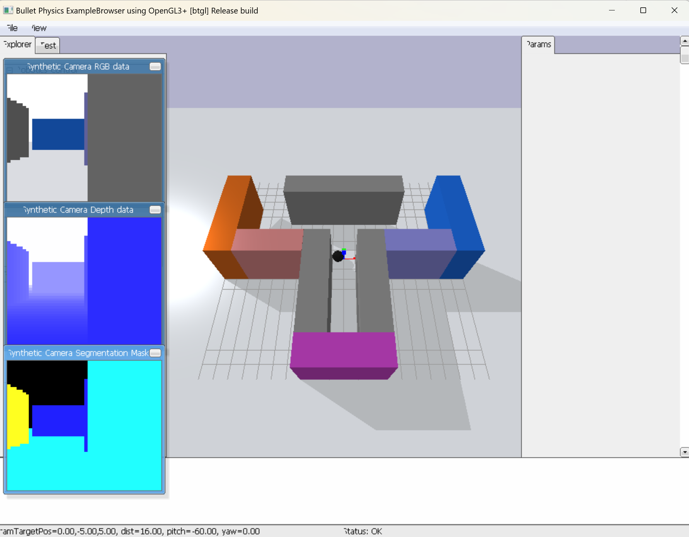

# Probabilistic Graphical Models (COMP 588) Final Project, Winter 2025

The current repository is adapted from the implementation of "**Synergizing habits and goals with variational Bayes**" by Dongqi Han, Kenji Doya, Dongsheng Li and Jun Tani, published on *Nature Communications*.  [[Link]](https://www.nature.com/articles/s41467-024-48577-7)

### Install Requirements (typically takes a few minutes)

```bash
pip install -r requirements.txt 
```

This code was tested with Python 3.8 and PyTorch 2.0.1.

## Demo: play with trained agent for customized goal-directed planning

You can try to play with trained agent model for goal-directed planning (the agent used for Figure.5 in the [paper](https://www.nature.com/articles/s41467-024-48577-7)) in PyBullet GUI.

- You can customize the goal and see how the agent performs!
- Check the ipython notebook `goal-directed-planning-demo.ipynb` and get started!



## How to train and inference (Python, PyTorch)

### Habitization Experiment (Results for Figures 2, 3, 4)

```bash
python run_habitization_experiment.py --seed 42 --verbose 1 --gui 0
```
Set `--gui 1` if you want to see the visualized environment.

On Mila cluster, use the following command:
```bash
sbatch habit.sh
```
To run with out variational Bayes loss, set the argument ```--only_sac='True'```, and change the name of directories.

The default arguments (hyperparameters) are the same as used in the paper. For the information of the arguments in training the habitual behavior, see `run_habitization_experiment.py`

To run the models with different training steps in stage 2 (Figure 3), use the `--stage_3_start_step` argument.

### Flexible Goal-Directed Planning Experiment (Results for Figure 5)

```bash
python run_planning_experiment.py --seed 42 --verbose 1 --gui 0
```
On Mila cluster, run the following:
```bash
sbatch planning.sh
```
To run with out variational Bayes loss, set the argument ```--only_sac='True'```, and change the name of directories.

### Data format

The program takes around 12 hours with an average GPU of Mila cluster, the result data will be saved at `./data/` and `./details/` (and at `./planning/` for the planning experiment) in .mat files, for which you can load using MATLAB or scipy:

```python
import scipy.io as sio
data = sio.loadmat("xxx.mat")
```

The PyTorch model of the trained agent will also be saved at `./data/`, which can be loaded by `torch.load()`.
For the experiments without variational Bayes loss, the results are saved at different directories, that we define in the bash file.


## Tutorial on plotting the quantitative results in the article (MATLAB)

To replicate the plots, please ensure you have MATLAB version R2022b or later, and download the simulated result data from TODO.
(You may also train your own models using the guideline above).

The start, change the MATLAB working directory to ./data_analysis

### Figure 2b

```matlab
plot_adaptation_readaptation_progress("DATAPATH/details/")
```

Please modify DATAPATH to the data folder you downloaded.

### Figure 2c-h

```matlab
fig2_habitization_analysis("DATAPATH/data/")
```

### Figure 5b

```matlab
plot_adaptation_progress("DATAPATH/details/")
```

### Figure 5c

```matlab
plot_diversity_statistics("DATAPATH/details/")
```

### Figure 5d,e

```matlab
plot_planning_details("DATAPATH/planning/")
```